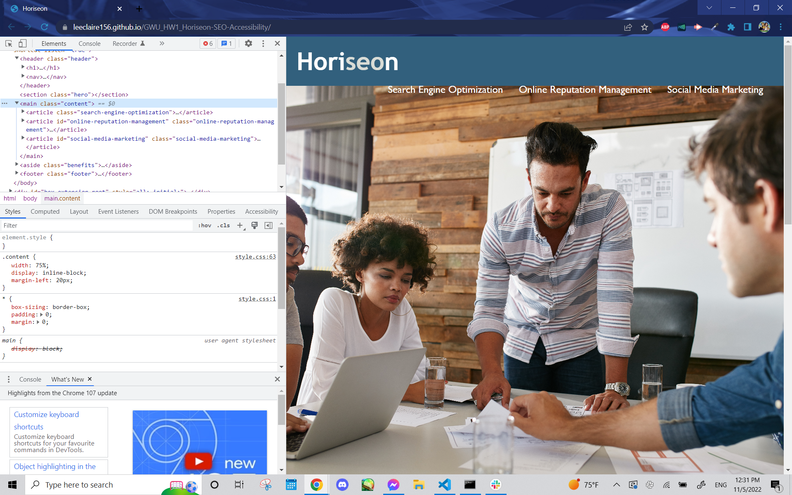

# <Horiseon SEO and Accessibility [Version 1.0] Update>

## Description

This repository replaced the previous div HTML tags with semantic HTML tags and added alternative text to images to a mock-up website called Horiseon. This was performed to improve the accessibility and search engine optimization of Horiseon. The usage of semantic HTML tags will allow the website to better match keywords in search engines, thereby increasing website traffic flow to Horiseon. Furthermore, the addition of alt (alternative) text to img (image) tags in the HTML file will improve accessibility, particularly to those using an on-screen reader and in events where images will not load.

## Usage

* Please click on the following link of the deployed website, remember to use Google Chrome to see Developer Tools: https://leeclaire156.github.io/GWU_HW1_Horiseon-SEO-Accessibility/

* Right-click anywhere on the page and select 'Inspect' to view HTML and CSS files.

* Alternatively, use the following keys to open the Developer Tools

MacOS Users: Command + Option + C

Windows Users: Control + Shift + C

## Credits

Credit for tutorial on linking screenshot image to README file goes to 
https://stackoverflow.com/questions/10189356/how-to-add-screenshot-to-readmes-in-github-repository
